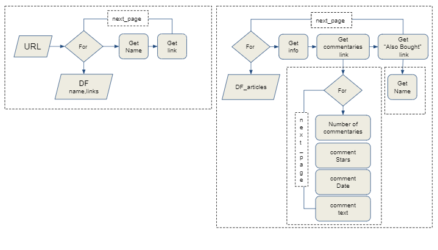
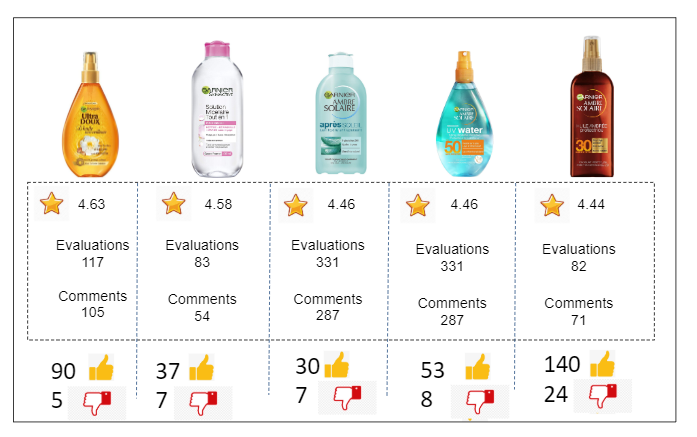

# E-comerce Product Evaluation

# Overview

The goal of this project is for us to practice what we have learned in the Intermediate Python and Data Engineering chapter of the program. 

We worked on building a pipeline to automate all process from data aquisition to the final visualization.

# Evaluate Garnier’s product   customers evaluation over e-commerce

* Identify better evaluated products
* Classify commentaries over good and bad
* Product most bought together
* Identify most used words over good and bad evaluations

# Data Aquisition

# Results

