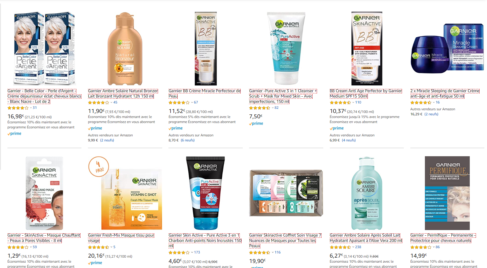

# E-comerce Product Evaluation

# Overview

I worked on building a pipeline to automate all process from data aquisition to the final visualization.

Evaluate Garnier’s product   customers evaluation over e-commerce

* Identify better evaluated products
* Classify commentaries over good and bad
* Product most bought together
* Identify most used words over good and bad evaluations

# Data Aquisition

Data was collected from a major e-commerce platform using web scraping techniques and  python requests library. I've narrowed down to a specific brand of products so I could have a more reduced scope of products. Acquisition consists of accessing the main webpage using a specific query. Each product name and link was read and their specific page accessed. I was able to gather 255 products with over 5000 comments and evaluations.

The website wacs mapped and scrapped for each product found and them their link was colected so it could be used to acess their rating and evaluation

# Results

Below are the top 5 product according to their evaluation to present the final results.

